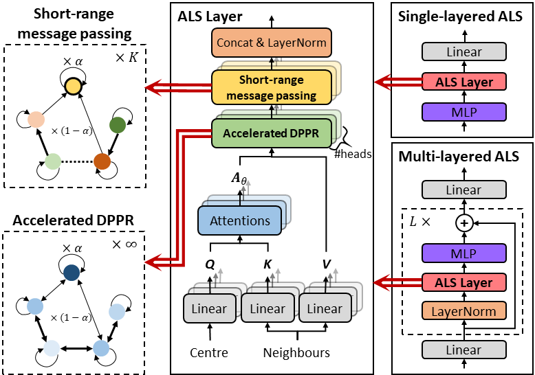

# ALS: Attentive Long-Short-Range Message Passing



## Abstract

ALS is a graph convolutional layer with infinite-long raneg message passing.

ALS combines Personalized PageRank (PPR) and the attention mechanism (GAT) to capture long-range and complex data dependancies in graphs.
We reduce the space complexity of its optimization from $O(L)$ to $O(1)$ with the implicit differentiation theory, and reduce up to 89.51% computation time with three acceleration techniques including the Krylov subspace methods.

Besides, we design a short-range message passing module for ALS to handle heterophily.

## Node Classification Performance

| Dataset                | Graph Type   | SotA method | SotA Accuracy | **ALS Accuracy** |
|------------------------|--------------|-------------|---------------|------------------|
| Amazon Computer        | Homophilic   | OrderedGNN  | 92.03         | **92.11**        |
| Amazon Photo           | Homophilic   | OrderedGNN  | 95.10         | **95.94**        |
| Coauthor CS            | Homophilic   | GGCN        | 95.25         | **96.22**        |
| Coauthor Physics       | Homophilic   | GGCN        | 97.07         | **97.54**        |
| WikiCS                 | Homophilic   | OrderedGNN  | 79.01         | **80.97**        |
| Roman Empire           | Heterophilic | GAT-sep     | 88.75         | **88.90**        |
| Amazon Ratings         | Heterophilic | GraphSAGE   | 53.63         | **54.10**        |
| Minesweeper            | Heterophilic | GAT-sep     | 93.91         | **95.55**        |
| Tolokers               | Heterophilic | GAT-sep     | 83.78         | **86.09**        |
| Questions              | Heterophilic | FSGNN       | **78.86**     | 78.26            |
| OGB-Arxiv | Large | - | [Leaderboard](https://ogb.stanford.edu/docs/leader_nodeprop/#ogbn-arxiv) | 72.71 |
| OGB-Products | Large | - | [Leaderboard](https://ogb.stanford.edu/docs/leader_nodeprop/#ogbn-products) | 81.78 |
| PascalVOC-SP           | Long-range   | GatedGCN    | 38.80         | **39.59**        |
| COCO-SP                | Long-range   | GatedGCN    | 29.22         | **30.08**        |
| PascalVOC-SP (with GT) | Long-range   | GraphGPS    | 44.40         | **44.93**        |
| COCO-SP (with GT)      | Long-range   | Graph Mamba | **39.74**     | 39.23            |

## Reproduce Experiments

```bash
args="--implicit --with-cg --with-basis --with-stop --max-epochs 1000 --runs 10 --early-stop-epochs 100 --hidden 32"

# For homophilic graphs
python3 -u main.py MPG amazon-com $args --heads 3 --n-layers 3 --dropout 0.3 --lr 0.010 --alpha 0.08 --asym --skip-connections 5 --weighted --dot-attention
python3 -u main.py MPG amazon-photo $args --heads 1 --n-layers 5 --dropout 0.5 --lr 0.010 --alpha 0.20 --asym --skip-connections 1 --weighted --dot-attention
python3 -u main.py MPG coauthor-cs $args --heads 5 --n-layers 4 --dropout 0.5 --lr 0.005 --alpha 0.39 --skip-connections 4
python3 -u main.py PG coauthor-phy $args --heads 2 --n-layers 0 --dropout 0.6 --lr 0.001 --alpha 0.46 --skip-connections 6 --weighted --dot-attention
python3 -u main.py PG wikics $args --heads 6 --n-layers 1 --dropout 0.4 --lr 0.001 --alpha 0.14 --asym --skip-connections 0 --weighted --dot-attention

# For heterophilic graphs
python3 -u main.py MPG roman_empire $args --heads 4 --n-layers 3 --dropout 0.5 --lr 0.010 --alpha 0.22 --asym --skip-connections 3 --weighted
python3 -u main.py MPG amazon_ratings $args --heads 10 --n-layers 3 --dropout 0.4 --lr 0.001 --alpha 0.53 --asym --skip-connections 1 --weighted
python3 -u main.py MPG minesweeper $args --heads 1 --n-layers 5 --dropout 0.4 --lr 0.001 --alpha 0.32 --asym --skip-connections 3 --weighted
python3 -u main.py PG tolokers $args --heads 1 --n-layers 2 --dropout 0.5 --lr 0.010 --alpha 0.07 --skip-connections 6
python3 -u main.py PG questions $args --heads 3 --n-layers 2 --dropout 0.7 --lr 0.001 --alpha 0.06 --skip-connections 5 --weighted

# For large graphs
python3 -u main.py PG arxiv $args --batched --lr 0.001 --heads 7 --n-layers 2 --dropout 0.5 --alpha 0.14 --skip-connections 5
python3 -u main.py MPG products $args --batched --lr 0.001 --heads 6 --n-layers 2 --dropout 0.3 --alpha 0.27 --asym --skip-connections 0

# For Long-range graph benchmarks 
# Codebase: https://github.com/toenshoff/LRGB
cd LRGB
for dataset in vocsuperpixels coco; do
    for method in ALS GPS-ALS; do
        for seed in 0 1 2 3; do
            python3 main.py --cfg config/LRGB-tuned/${dataset}-${method}.yaml seed $seed
        done
    done
done
```

## Citation
